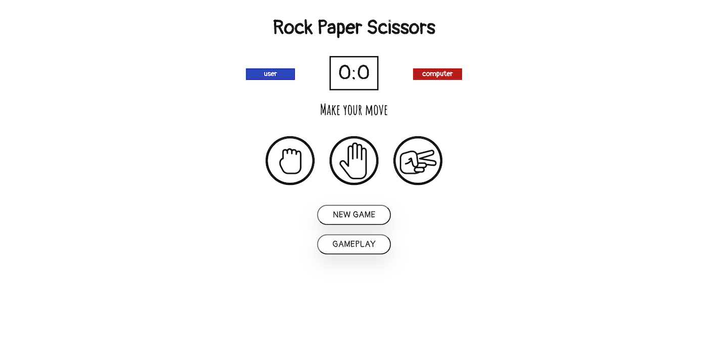

# The Odin Project: Rock Paper Scissors

## Table of contents

- [Overview](#overview)
  - [Live Preview](#Live-preview)
  - [Screenshot](#screenshot)
- [My process](#my-process)
  - [Built with](#built-with)
  - [What I learned](#what-i-learned)
  - [Continued development](#continued-development)
  - [Acknowledgements](#acknowledgements)

## Overview

### Live preview

[Click Here](https://bhornbhaya.github.io/odin-rock-paper-scissors/)

### Screenshot

### Desktop Version

## My process

### Built with

- HTML
- CSS
- JavaScript
- Sass

### What I learned

- How to think about the overall layout of the project
- How to break problems into smaller ones and make it easier to solve
- How to apply fundamental javascript I learned to a real world project
- How to create functions
- How to use if-else statement
- How to use for loop
- DOM and Event Handling

### What needs to be improved

- Save scores in database
- Allow user to type their name

## Acknowledgements

This is a project challenged by [the Odin Project](theodinproject.com)

Coded by [me](https://www.linkedin.com/in/bhornbhaya/)
